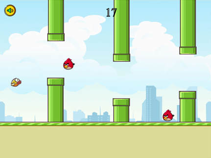

# Flappy-Bird-Game

## Screenshots

### Start screen
Start the game by right-clicking. 
Mute / Play button: By pressing the button the game will be muted, with another press the mute will be canceled.

### Game screen
Bounce the bird by pressing the right mouse button. 
In the event of a collision with one of the pipes/ground/upper and lower limits of the pipes - the user is disqualified and the game ends. 
Each pipe that the bird passe- the score rises by a point.

  

### End screen
In case of disqualification, the following screen will be displayed to the user. Click the Start button to start a new game. 
Medals: 
1. Gold medal for a grade that reaches a high grade/equal to the "best"  
2. Bronze medal for a score that reaches a minimum score of 10  
3. Silver medal for a score that reaches a minimum score of 5

  

### Challenge
Once the user reaches a score of 15 the game becomes more challenging: 
Reducing the space between the top and bottom tube and adding angry birds moving on the X-axis to prevent the little bird from moving forward, 
in case there is a collision between an angry bird and the little bird the user is disqualified.

  

